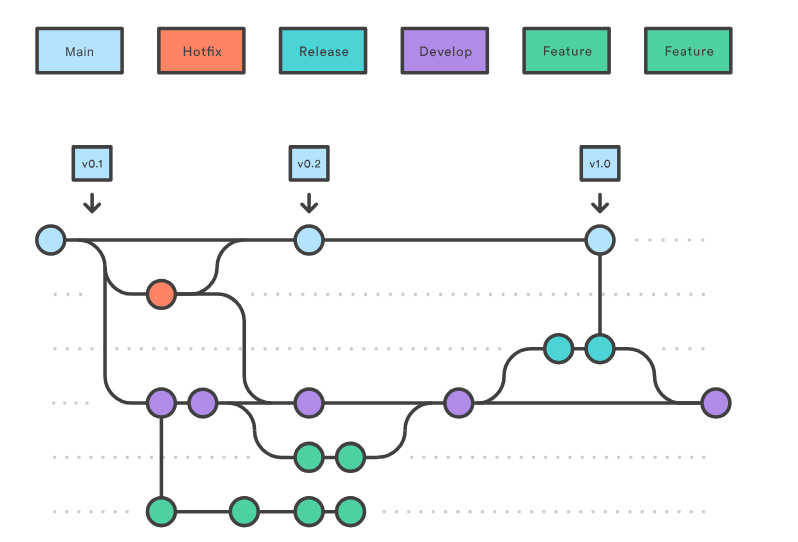
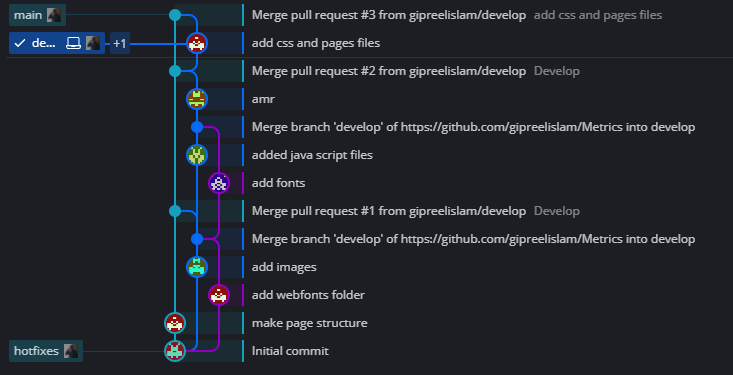

# Security-Task
1. Fork the Repo
2. Write Your name, email and your project Repo Link in the excel file
3. Save using Git
4. Create a pull request
5. Deadline on Tuesday 10:00 pm
6. Good Luck :)

## Metrics (Our Project)
You can visit our site from the link below
[Link](https://gipreelislam.github.io/Metrics/)
we published our site using github host

### Metrics Description
our project is a front-end web page build by 6 students  
[Repo Link](https://github.com/gipreelislam/Metrics.git)
____
#### Project Workflow on Github
we use gitflow workflow but we just make 3 branches
- main branch
- develop branch
- hotfix branch

We use gitkraken to visualize the workflow on the branches

